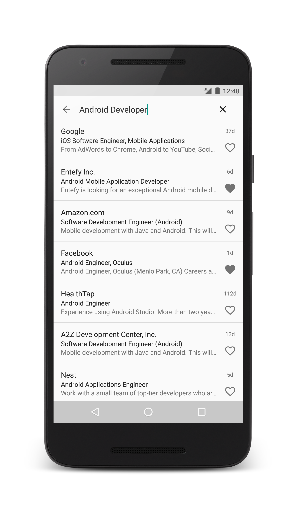
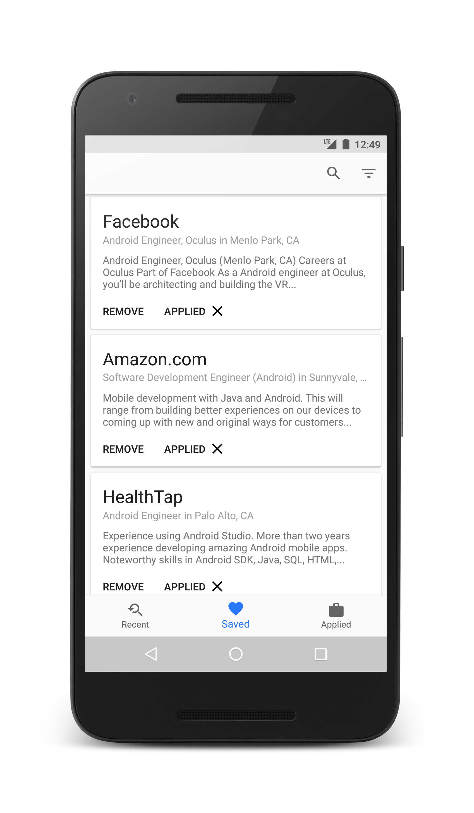

# Job Hunt

Use Job Hunt to find your next job. Select a location and a job title and Indeed's comprehensive search results will provide you with thousands of available opportunities. Find a job you like? Go ahead and save it. With Job Hunt, you can also specify what jobs you've applied to so you can keep track of your applications.
 

### Download from Play Store


<a href="https://play.google.com/store/apps/details?id=com.josecalles.jobhunt" target="_blank" >


### Screenshots






### Configuration

In your `gradle.properties` file, add your Indeed Publisher id as follows:
`indeed_publisher_id=your_id`

### License


```
Copyright 2016,  Jose Calles

Licensed under the Apache License, Version 2.0 (the "License");
you may not use this file except in compliance with the License.
You may obtain a copy of the License at

        http://www.apache.org/licenses/LICENSE-2.0

Unless required by applicable law or agreed to in writing, software
distributed under the License is distributed on an "AS IS" BASIS,
WITHOUT WARRANTIES OR CONDITIONS OF ANY KIND, either express or implied.
See the License for the specific language governing permissions and
limitations under the License.
```
